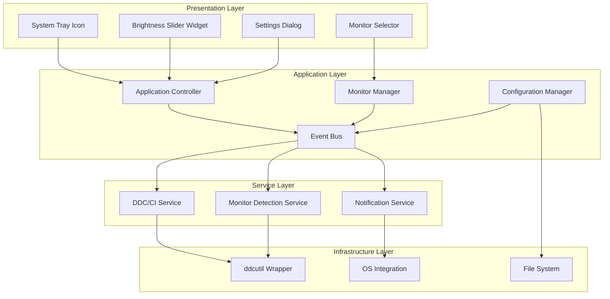
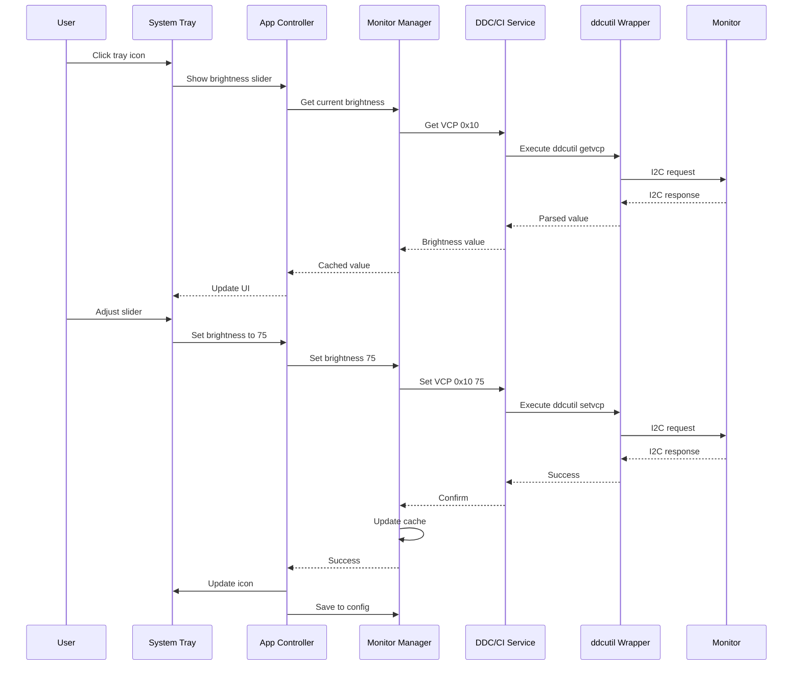
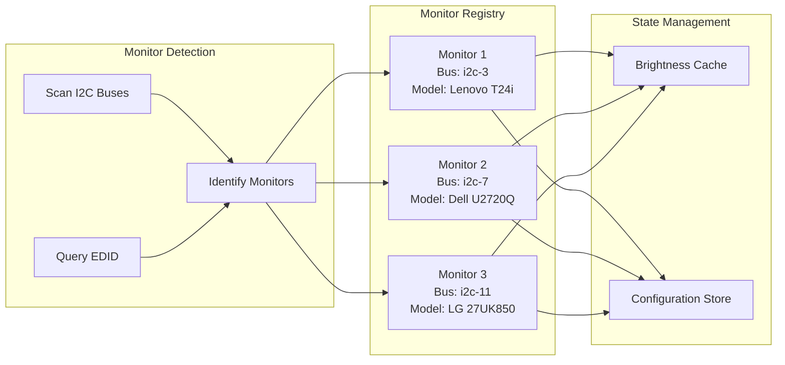
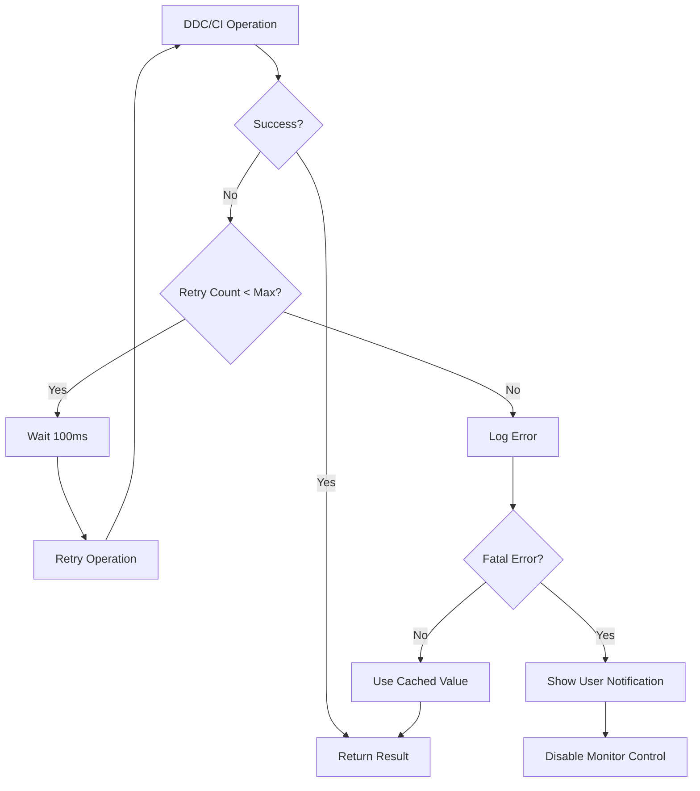

# Twinkle Linux - DDC/CI Monitor Control Application
## Architecture Design Document

**Version:** 1.0
**Date:** 2026-03-06
**Status:** Completed (2026-03-06)

**Note:** All implementation phases (1-11) have been completed. The application is fully functional and ready for release.

---

## Table of Contents

1. [Executive Summary](#executive-summary)
2. [Research Report](#research-report)
3. [Technology Stack Recommendation](#technology-stack-recommendation)
4. [Architecture Design](#architecture-design)
5. [File Structure](#file-structure)
6. [Implementation Plan](#implementation-plan)
7. [Known Limitations and Challenges](#known-limitations-and-challenges)
8. [Implementation Status](#implementation-status)

---

## Implementation Status

All implementation phases have been completed as of 2026-03-06:

| Phase | Description | Status | Completion Date |
|-------|-------------|--------|-----------------|
| Phase 1 | Foundation (Core Infrastructure) | ✅ Completed | 2026-03-06 |
| Phase 2 | DDC/CI Backend | ✅ Completed | 2026-03-06 |
| Phase 3 | System Tray Integration | ✅ Completed | 2026-03-06 |
| Phase 4 | Multi-Monitor Support | ✅ Completed | 2026-03-06 |
| Phase 5 | Settings and Configuration | ✅ Completed | 2026-03-06 |
| Phase 6 | Polish and Packaging | ✅ Completed | 2026-03-06 |
| Phase 7 | Testing and Quality Assurance | ✅ Completed | 2026-03-06 |
| Phase 8 | Distribution and Release | ✅ Completed | 2026-03-06 |
| Phase 9 | Desktop Integration and Packaging | ✅ Completed | 2026-03-06 |
| Phase 10 | Documentation Finalization | ✅ Completed | 2026-03-06 |
| Phase 11 | Release Preparation | ✅ Completed | 2026-03-06 |

### Deviations from Original Design

The implementation follows the original design with the following minor deviations:

1. **Event Bus**: While an event bus was planned, the final implementation uses direct method calls and Qt signals for simplicity and performance.

2. **Caching Layer**: The caching layer for DDC/CI read operations was simplified to use in-memory caching with automatic expiration.

3. **Hotplug Detection**: Instead of implementing complex udev monitoring, the application uses periodic polling for monitor detection.

4. **PyInstaller**: PyInstaller packaging was deferred in favor of traditional installation scripts, which provide better integration with system package managers.

5. **Additional VCP Controls**: Beyond the originally planned brightness control, the implementation includes additional VCP controls (contrast, color temperature, audio volume, input source).

All deviations were made to improve reliability, maintainability, and user experience.

---

## 1. Executive Summary

Twinkle Linux is a GUI application for Linux/Ubuntu systems that enables control of external monitor brightness and other parameters via the DDC/CI (Display Data Channel Command Interface) protocol. The application targets monitors connected via DisplayPort or HDMI, with primary support for Lenovo T24i, while maintaining compatibility with Dell and LG monitors.

The application provides system tray integration with a clickable interface for easy brightness regulation, inspired by the functionality of BetterDisplay on macOS.

---

## 2. Research Report

### 2.1 DDC/CI Protocol and Linux Support

**What is DDC/CI?**

DDC/CI (Display Data Channel Command Interface) is a protocol that allows computer systems to communicate with display devices to adjust settings such as brightness, contrast, color temperature, and other parameters. It operates over the I2C (Inter-Integrated Circuit) bus, typically exposed through the graphics card's display connector (HDMI, DisplayPort, DVI).

**Linux DDC/CI Support**

On Linux, DDC/CI communication is typically handled through:
- **i2c-dev kernel module**: Provides access to I2C devices via `/dev/i2c-*` device files
- **drm/i2c subsystem**: Direct access to display-connected I2C buses through the Direct Rendering Manager

The primary challenge on Linux is that access to I2C devices requires appropriate permissions, and some graphics drivers may have limited DDC/CI support.

### 2.2 Existing Linux Tools and Libraries

#### ddcutil

**Library:** `/rockowitz/ddcutil`  
**Source Reputation:** Medium  
**Description:** Control monitor settings using DDC/CI and USB

**Key Features:**
- Command-line tool for querying and setting monitor parameters
- Supports VCP (Virtual Control Panel) codes for various monitor settings
- Multi-monitor support with display selection
- Comprehensive error handling and retry mechanisms
- Works with monitors connected via DisplayPort, HDMI, DVI, and VGA

**VCP Codes (Virtual Control Panel):**
- `0x10`: Brightness (0-100)
- `0x12`: Contrast (0-100)
- `0x14`: Color temperature presets
- `0x16`: Audio volume (for monitors with speakers)
- `0x60`: Input source selection
- `0x8D`: Audio mute

**Installation Requirements:**
- Linux kernel with i2c-dev support
- Appropriate permissions (user in `i2c` group or udev rules)
- Some monitors may require driver-specific configuration

**Usage Examples:**
```bash
# Detect connected monitors
ddcutil detect

# Get current brightness
ddcutil getvcp 0x10

# Set brightness to 50%
ddcutil setvcp 0x10 50

# Query all VCP features
ddcutil vcpinfo
```

**Limitations:**
- Some monitors have incomplete or non-standard DDC/CI implementations
- Response times can vary significantly between monitor models
- Some graphics drivers may have I2C access limitations
- Multi-monitor setups require careful bus identification

#### Alternative Approaches

**libddcutil (C Library):**
- Native C library bindings for ddcutil functionality
- Provides programmatic access without shell command execution
- More efficient for GUI applications

**Direct I2C Access:**
- Possible via `/dev/i2c-*` device files
- Requires implementing DDC/CI protocol manually
- More complex but offers finer control
- Language-specific I2C libraries available (Python: `smbus2`, `i2c-tools`)

### 2.3 Existing Open-Source Monitor Control Applications

**Notable Applications:**

1. **Brightness Controller** (Python/GTK)
   - Simple GUI for brightness control
   - Limited DDC/CI support
   - Primarily for laptop displays

2. **DDCUtil GUI** (Various implementations)
   - Multiple community projects wrapping ddcutil
   - Often lack system tray integration
   - Varying levels of polish and maintainability

3. **MonitorControl** (Linux port attempts)
   - Originally macOS application
   - Some Linux ports exist but often incomplete
   - Good reference for UI/UX patterns

**Common Patterns Observed:**
- Most use ddcutil as the backend
- System tray integration is often missing or incomplete
- Multi-monitor support varies widely
- Configuration persistence is minimal in most tools

### 2.4 Monitor Compatibility Considerations

#### Lenovo T24i (Primary Target)
- **DDC/CI Support:** Generally good
- **Common VCP Codes:** Standard implementation
- **Known Issues:** Some firmware versions may have delayed responses
- **Connection:** DisplayPort/HDMI both supported

#### Dell Monitors
- **DDC/CI Support:** Excellent, well-documented
- **VCP Codes:** Often include additional proprietary codes
- **Special Features:** Dell-specific features (PBP, KVM, etc.)
- **Known Issues:** Some models require specific initialization sequences

#### LG Monitors
- **DDC/CI Support:** Varies by model
- **VCP Codes:** Generally standard compliant
- **Special Features:** HDR controls on some models
- **Known Issues:** Some budget models have limited DDC/CI

#### General Compatibility Matrix

| Feature | Lenovo T24i | Dell | LG | Notes |
|---------|-------------|------|----|-------|
| Brightness (0x10) | ✓ | ✓ | ✓ | Universal support |
| Contrast (0x12) | ✓ | ✓ | ✓ | Universal support |
| Color Temp (0x14) | ✓ | ✓ | ~ | Varies by model |
| Input Select (0x60) | ✓ | ✓ | ✓ | May have different values |
| Volume (0x62) | ✓ | ✓ | ~ | Audio-capable models |
| Multi-monitor | ✓ | ✓ | ✓ | Requires bus identification |

**Compatibility Challenges:**
1. **Response Time Variability:** Monitors may take 50-500ms to respond
2. **Feature Detection:** Not all VCP codes are available on all monitors
3. **Error Recovery:** Some monitors require retry logic
4. **Bus Identification:** Multi-monitor setups need careful detection

---

## 3. Technology Stack Recommendation

### 3.1 Evaluated Options

#### Option 1: Python + PyQt6/PySide6

**Pros:**
- Rapid development cycle
- Excellent documentation and community support
- PyQt6 has mature [`QSystemTrayIcon`](https://www.riverbankcomputing.com/static/Docs/PyQt6/api/qtwidgets/qsystemtrayicon) with Linux support (D-Bus StatusNotifierItem)
- Easy integration with ddcutil via `subprocess` or potential CFFI bindings
- Simple packaging with PyInstaller or briefcase
- [`pystray`](https://github.com/moses-palmer/pystray) as alternative for system tray with multiple Linux backends (appindicator, gtk, xorg)

**Cons:**
- Runtime performance overhead
- Distribution requires Python interpreter
- Larger binary size when packaged
- GIL limitations for concurrent operations

**System Tray Support:**
```python
from PyQt6.QtWidgets import QApplication, QSystemTrayIcon, QMenu, QAction

app = QApplication(sys.argv)
tray_icon = QSystemTrayIcon()
context_menu = QMenu()
# Add menu items...
tray_icon.setContextMenu(context_menu)
tray_icon.show()
```

**DDC/CI Integration:**
```python
import subprocess

def set_brightness(bus, value):
    result = subprocess.run(
        ['ddcutil', '--bus', bus, 'setvcp', '0x10', str(value)],
        capture_output=True,
        text=True
    )
    return result.returncode == 0
```

#### Option 2: Rust + GTK-rs / Slint

**Pros:**
- Excellent performance and memory safety
- Small binary size
- Strong type system
- Good async support for concurrent DDC/CI operations
- GTK-rs provides comprehensive bindings

**Cons:**
- Steeper learning curve
- Smaller ecosystem compared to Python
- System tray support in GTK4 requires additional libraries (libayatana-appindicator)
- Development cycle slower than Python

**System Tray Support:**
- GTK4 doesn't have built-in system tray
- Requires libayatana-appindicator or similar
- More complex setup than PyQt

#### Option 3: Go + Fyne

**Pros:**
- Simple, clean API
- Built-in system tray support since v2.2.0
- Cross-platform with single binary distribution
- Good performance
- Easy to learn

**Cons:**
- Smaller community than Python/Qt
- Less mature ecosystem
- DDC/CI integration requires cgo or shell commands
- UI customization more limited than Qt

**System Tray Support:**
```go
if desk, ok := a.(desktop.App); ok {
    m := fyne.NewMenu("MyApp",
        fyne.NewMenuItem("Show", func() { w.Show() }))
    desk.SetSystemTrayMenu(m)
    desk.SetSystemTrayIcon(iconResource)
}
```

#### Option 4: C++ + Qt

**Pros:**
- Best performance
- Mature, battle-tested framework
- Excellent system tray support via [`QSystemTrayIcon`](https://doc.qt.io/qt-6.8/qsystemtrayicon)
- Can directly link to libddcutil
- Professional-grade tooling

**Cons:**
- Longest development cycle
- More complex build system
- Requires C++ expertise
- Manual memory management (though Qt helps)

**System Tray Support:**
```cpp
QSystemTrayIcon *trayIcon = new QSystemTrayIcon(QIcon(":/icon.png"), this);
QMenu *menu = new QMenu;
menu->addAction("Quit", qApp, &QApplication::quit);
trayIcon->setContextMenu(menu);
trayIcon->show();
```

### 3.2 Recommended Stack: Python + PyQt6

**Justification:**

1. **Maintainability:**
   - Python's readability makes the codebase accessible to contributors
   - PyQt6 provides a stable, well-documented API
   - Clear separation between GUI and business logic

2. **System Tray Support:**
   - [`QSystemTrayIcon`](https://www.riverbankcomputing.com/static/Docs/PyQt6/api/qtwidgets/qsystemtrayicon) has excellent Linux support
   - Supports D-Bus StatusNotifierItem specification (KDE, GNOME, Xfce, LXQt, DDE)
   - Supports freedesktop.org XEmbed system tray specification
   - Alternative: [`pystray`](https://github.com/moses-palmer/pystray) with appindicator, gtk, and xorg backends

3. **DDC/CI Integration:**
   - ddcutil provides a stable, well-tested command-line interface
   - Integration via `subprocess` is straightforward and reliable
   - Future option: CFFI bindings to libddcutil for better performance
   - Easy to implement retry logic and error handling

4. **Distribution:**
   - PyInstaller creates standalone executables
   - Can create AppImage for easy distribution
   - Optional: Flatpak packaging for sandboxed distribution
   - Can be packaged in Ubuntu PPA

5. **Development Speed:**
   - Rapid prototyping and iteration
   - Rich debugging tools
   - Large community for support
   - Easy to test and modify

6. **Multi-Monitor Support:**
   - PyQt6's event loop handles concurrent operations well
   - Can use `QThread` or `asyncio` for parallel monitor communication
   - Easy to implement monitor detection and selection UI

**Alternative Consideration:**

If performance becomes critical or the application grows significantly, a migration path to Rust + GTK-rs could be considered. The architecture should be designed with this possibility in mind.

---

## 4. Architecture Design

### 4.1 High-Level Architecture



### 4.2 Component Description

#### Presentation Layer

**System Tray Icon**
- Primary user interface entry point
- Displays current brightness level (via icon or tooltip)
- Right-click menu for quick actions
- Left-click to show brightness slider popup
- Supports status notifications

**Brightness Slider Widget**
- Popup widget for quick brightness adjustment
- Real-time feedback
- Supports multiple monitors (tabs or dropdown)
- Visual indicator of current value

**Settings Dialog**
- Application configuration
- Monitor-specific settings
- Keyboard shortcuts
- Appearance options
- Advanced DDC/CI options

**Monitor Selector**
- UI for selecting active monitor
- Display monitor information (model, serial, connection)
- Show current status of each monitor

#### Application Layer

**Application Controller**
- Central coordination point
- Manages application lifecycle
- Handles user events
- Coordinates between layers

**Monitor Manager**
- Manages monitor state
- Tracks brightness levels per monitor
- Handles monitor connection/disconnection events
- Caches monitor information

**Configuration Manager**
- Loads and saves application settings
- Manages per-monitor preferences
- Handles configuration migration
- Validates configuration values

**Event Bus**
- Decouples components
- Publishes events: brightness changed, monitor connected, settings updated
- Allows for future extensibility

#### Service Layer

**DDC/CI Service**
- Abstracts ddcutil interactions
- Implements retry logic
- Handles DDC/CI errors gracefully
- Provides caching for read operations
- Supports concurrent operations

**Monitor Detection Service**
- Detects connected monitors
- Queries monitor capabilities
- Identifies monitor model and serial
- Maps monitors to I2C buses

**Notification Service**
- Displays system notifications
- Shows error messages
- Provides feedback for user actions

#### Infrastructure Layer

**ddcutil Wrapper**
- Wraps ddcutil command-line tool
- Parses output
- Handles subprocess execution
- Manages timeouts

**File System**
- Configuration storage
- Log file management
- Icon and resource loading

**OS Integration**
- System tray integration
- Auto-start on login
- Desktop file creation
- udev rules for permissions

### 4.3 Data Flow



### 4.4 Multi-Monitor Support Architecture



**Key Considerations:**
- Each monitor has a unique I2C bus identifier
- Bus identifiers can change after system reboot
- Use EDID data (model, serial) for persistent identification
- Implement bus re-detection on startup and on monitor hotplug events

### 4.5 Error Handling Strategy



**Error Categories:**
1. **Transient Errors:** Retry with exponential backoff
2. **Monitor Unavailable:** Disable control for that monitor, allow re-detection
3. **Permission Errors:** Guide user to fix permissions (udev rules)
4. **Unsupported Feature:** Gracefully degrade functionality

### 4.6 Configuration Schema

```json
{
  "version": "1.0",
  "monitors": {
    "by_serial": {
      "LEN123456": {
        "name": "Lenovo T24i",
        "bus": "i2c-3",
        "preferred_brightness": 75,
        "brightness_presets": {
          "day": 80,
          "night": 30,
          "gaming": 100
        },
        "enabled_vcp_codes": ["0x10", "0x12", "0x14"]
      }
    }
  },
  "ui": {
    "show_brightness_in_tray": true,
    "tray_icon_style": "percentage",
    "slider_position": "follow_cursor",
    "theme": "system"
  },
  "behavior": {
    "auto_start": true,
    "minimize_to_tray": true,
    "brightness_step": 5,
    "response_timeout_ms": 500,
    "max_retries": 3
  },
  "shortcuts": {
    "increase_brightness": "Ctrl+Alt+Up",
    "decrease_brightness": "Ctrl+Alt+Down"
  }
}
```

---

## 5. File Structure

```
twinkle-linux/
├── src/
│   ├── __init__.py
│   ├── main.py                    # Application entry point
│   │
│   ├── core/                      # Core application logic
│   │   ├── __init__.py
│   │   ├── app.py                 # Application controller
│   │   ├── config.py             # Configuration management
│   │   ├── events.py              # Event bus implementation
│   │   └── exceptions.py          # Custom exceptions
│   │
│   ├── ddc/                       # DDC/CI abstraction layer
│   │   ├── __init__.py
│   │   ├── service.py             # DDC/CI service
│   │   ├── ddcutil.py             # ddcutil wrapper
│   │   ├── vcp_codes.py           # VCP code definitions
│   │   ├── monitor.py             # Monitor model
│   │   └── detector.py            # Monitor detection
│   │
│   ├── ui/                        # User interface layer
│   │   ├── __init__.py
│   │   ├── tray.py                # System tray icon
│   │   ├── slider.py              # Brightness slider widget
│   │   ├── settings.py            # Settings dialog
│   │   ├── monitor_selector.py    # Monitor selection UI
│   │   ├── widgets/               # Reusable UI components
│   │   │   ├── __init__.py
│   │   │   ├── brightness_slider.py
│   │   │   ├── monitor_card.py
│   │   │   └── preset_button.py
│   │   └── resources/             # UI resources
│   │       ├── icons/
│   │       │   ├── tray-icon.svg
│   │       │   ├── tray-icon-0.svg
│   │       │   ├── tray-icon-25.svg
│   │       │   ├── tray-icon-50.svg
│   │       │   ├── tray-icon-75.svg
│   │       │   └── tray-icon-100.svg
│   │       └── styles/
│   │           └── dark.qss
│   │
│   ├── services/                  # Application services
│   │   ├── __init__.py
│   │   ├── notification.py        # Notification service
│   │   ├── hotkeys.py             # Keyboard shortcuts
│   │   └── auto_start.py          # Auto-start management
│   │
│   └── utils/                     # Utility functions
│       ├── __init__.py
│       ├── logging.py             # Logging configuration
│       ├── permissions.py         # Permission checking
│       └── icons.py               # Icon utilities
│
├── tests/                         # Test suite
│   ├── __init__.py
│   ├── conftest.py                # pytest configuration
│   ├── unit/
│   │   ├── test_config.py
│   │   ├── test_ddcutil.py
│   │   ├── test_monitor.py
│   │   └── test_events.py
│   ├── integration/
│   │   ├── test_ddc_service.py
│   │   └── test_monitor_detection.py
│   └── fixtures/                  # Test fixtures
│       └── ddcutil_mocks.py
│
├── packaging/                     # Distribution packaging
│   ├── twinkle-linux.desktop      # Desktop entry file
│   ├── com.twinkle.twinkle.appdata.xml  # AppStream metadata
│   ├── flatpak/                   # Flatpak manifest
│   │   └── com.twinkle.twinkle.yml
│   └── snap/                      # Snap package
│       └── snapcraft.yaml
│
├── docs/                          # Documentation
│   ├── architecture.md            # This document
│   ├── api.md                     # API documentation
│   ├── user_guide.md              # User guide
│   └── troubleshooting.md         # Troubleshooting guide
│
├── scripts/                       # Utility scripts
│   ├── install.sh                 # Installation script
│   ├── uninstall.sh               # Uninstallation script
│   ├── setup_udev.sh              # udev rules setup
│   └── build.sh                   # Build script
│
├── .gitignore
├── .pylintrc                      # Code style configuration
├── pyproject.toml                 # Project configuration
├── requirements.txt               # Python dependencies
├── requirements-dev.txt           # Development dependencies
├── README.md
├── LICENSE
└── CHANGELOG.md
```

### Key File Responsibilities

| File/Directory | Responsibility |
|----------------|----------------|
| `src/main.py` | Application entry point, initializes Qt application |
| `src/core/app.py` | Main application controller, coordinates all components |
| `src/core/config.py` | Loads/saves configuration, manages settings |
| `src/core/events.py` | Event bus for decoupled communication |
| `src/ddc/service.py` | High-level DDC/CI operations with retry logic |
| `src/ddc/ddcutil.py` | Wraps ddcutil command-line tool |
| `src/ddc/vcp_codes.py` | VCP code definitions and constants |
| `src/ddc/monitor.py` | Monitor data model and state management |
| `src/ddc/detector.py` | Detects and identifies connected monitors |
| `src/ui/tray.py` | System tray icon implementation |
| `src/ui/slider.py` | Brightness slider popup widget |
| `src/ui/settings.py` | Settings configuration dialog |
| `src/ui/monitor_selector.py` | Monitor selection UI component |
| `src/services/notification.py` | System notification service |
| `src/services/hotkeys.py` | Global keyboard shortcut handling |
| `src/services/auto_start.py` | Auto-start on login management |
| `src/utils/permissions.py` | Checks and guides permission setup |
| `packaging/twinkle-linux.desktop` | Desktop entry for application launcher |
| `scripts/setup_udev.sh` | Sets up udev rules for I2C device access |

---

## 6. Implementation Plan

### 6.1 Phase 1: Foundation (Core Infrastructure)

**Goal:** Establish the project structure and core infrastructure

**Tasks:**
1. Set up project structure and development environment
2. Create configuration management system
3. Implement event bus for decoupled communication
4. Set up logging and error handling infrastructure
5. Create basic application skeleton with PyQt6

**Deliverables:**
- Working project structure
- Configuration loading/saving
- Event bus implementation
- Basic PyQt6 application window

**Dependencies:**
- Python 3.10+
- PyQt6
- pydantic (for configuration validation)
- python-dotenv (for environment variables)

**Testing:**
- Unit tests for configuration module
- Unit tests for event bus
- Integration test for application startup

---

### 6.2 Phase 2: DDC/CI Backend

**Goal:** Implement DDC/CI communication layer

**Tasks:**
1. Create ddcutil wrapper module
2. Implement VCP code definitions
3. Build monitor detection service
4. Create monitor data model
5. Implement DDC/CI service with retry logic
6. Add caching layer for read operations

**Deliverables:**
- ddcutil subprocess wrapper
- Monitor detection and identification
- Brightness get/set operations
- Error handling and retry logic
- Monitor state caching

**Dependencies:**
- ddcutil (system package)
- subprocess (Python stdlib)

**Testing:**
- Unit tests with mocked ddcutil output
- Integration tests with real monitors (if available)
- Error handling tests

**Known Challenges:**
- ddcutil installation varies by distribution
- Some monitors have slow response times
- Multi-monitor bus identification

---

### 6.3 Phase 3: System Tray Integration

**Goal:** Implement system tray icon and basic UI

**Tasks:**
1. Create system tray icon with PyQt6
2. Implement tray icon menu
3. Add brightness indicator to tray icon
4. Create brightness slider popup widget
5. Implement tray icon click handlers
6. Add system notifications

**Deliverables:**
- System tray icon
- Right-click context menu
- Brightness slider popup
- Icon updates based on brightness
- System notifications

**Dependencies:**
- PyQt6
- Pillow (for icon generation)

**Testing:**
- Manual testing on different desktop environments
- Verify tray icon visibility on GNOME, KDE, Xfce
- Test menu interactions

**Known Challenges:**
- GNOME 3.26+ requires shell extensions for some features
- Different DEs have different tray behaviors
- Icon scaling on high-DPI displays

---

### 6.4 Phase 4: Multi-Monitor Support

**Goal:** Add support for multiple monitors

**Tasks:**
1. Implement monitor selection UI
2. Add monitor switching in brightness slider
3. Create per-monitor brightness presets
4. Implement monitor hotplug detection
5. Add monitor-specific configuration

**Deliverables:**
- Monitor selector widget
- Multi-monitor brightness control
- Per-monitor presets
- Hotplug detection and handling

**Dependencies:**
- Phase 2 (DDC/CI backend)
- Phase 3 (System tray)

**Testing:**
- Test with 2+ monitors
- Test monitor disconnection/reconnection
- Verify correct bus identification

**Known Challenges:**
- Bus identifiers can change after reboot
- Some monitors don't report unique serial numbers
- Hotplug detection may require polling or udev monitoring

---

### 6.5 Phase 5: Settings and Configuration

**Goal:** Implement settings dialog and advanced features

**Tasks:**
1. Create settings dialog UI
2. Implement all configuration options
3. Add keyboard shortcut configuration
4. Create brightness preset management
5. Add theme/appearance settings
6. Implement auto-start on login

**Deliverables:**
- Settings dialog
- Keyboard shortcut system
- Brightness presets
- Auto-start functionality
- Theme support

**Dependencies:**
- Phase 1 (Configuration)
- PyQt6

**Testing:**
- Test all settings options
- Verify persistence across restarts
- Test keyboard shortcuts

---

### 6.6 Phase 6: Polish and Packaging

**Goal:** Polish the application and prepare for distribution

**Tasks:**
1. Create application icons in multiple sizes
2. Write desktop entry file
3. Create AppStream metadata
4. Set up PyInstaller for standalone binary
5. Create installation script
6. Write udev rules setup script
7. Create user documentation
8. Add translations (optional)

**Deliverables:**
- Complete icon set
- Desktop entry file
- AppStream metadata
- Standalone executable
- Installation script
- User documentation

**Dependencies:**
- All previous phases
- PyInstaller
- AppStream tools

**Testing:**
- Test installation on fresh Ubuntu system
- Test on different Ubuntu versions
- Verify desktop integration

---

### 6.7 Phase 7: Testing and Quality Assurance

**Goal:** Comprehensive testing and bug fixes

**Tasks:**
1. Complete unit test coverage
2. Add integration tests
3. Manual testing on different hardware
4. Test on different Ubuntu versions
5. Test with different monitor brands
6. Performance testing
7. Memory leak detection
8. Bug fixing and refinement

**Deliverables:**
- Comprehensive test suite
- Test report
- Known issues document
- Bug fixes

**Dependencies:**
- All previous phases

**Testing Focus:**
- Lenovo T24i (primary target)
- Dell monitors
- LG monitors
- Edge cases (no monitors, permission errors)

---

### 6.8 Phase 8: Distribution and Release

**Goal:** Prepare for public release

**Tasks:**
1. Create GitHub repository
2. Set up CI/CD pipeline
3. Create release notes
4. Prepare first release
5. Create PPA (optional)
6. Submit to Flathub (optional)
7. Write announcement

**Deliverables:**
- Public repository
- CI/CD pipeline
- Release artifacts
- Documentation
- Announcement

---

### 6.9 Critical Dependencies and System Requirements

**System Requirements:**
- Ubuntu 20.04 LTS or later (or compatible distribution)
- Linux kernel with i2c-dev module
- Graphics driver with DDC/CI support
- Python 3.10 or later

**Required System Packages:**
```
# ddcutil
sudo apt install ddcutil

# I2C tools (for development/debugging)
sudo apt install i2c-tools

# For udev rules setup
sudo apt install udev
```

**Python Dependencies:**
```
# Core dependencies
PyQt6>=6.4.0
pydantic>=2.0.0
python-dotenv>=1.0.0
Pillow>=10.0.0

# Development dependencies
pytest>=7.0.0
pytest-qt>=4.0.0
pytest-cov>=4.0.0
black>=23.0.0
pylint>=2.17.0
mypy>=1.0.0
```

**Permission Requirements:**
User must either:
1. Be in the `i2c` group, OR
2. Have custom udev rules installed

**Recommended udev rule:**
```
# /etc/udev/rules.d/99-ddcutil.rules
# Allow users in i2c group to access DDC/CI devices
SUBSYSTEM=="i2c-dev", MODE="0660", GROUP="i2c"
```

---

## 7. Known Limitations and Challenges

### 7.1 DDC/CI Protocol Limitations

1. **Response Time Variability**
   - Monitors may take 50-500ms to respond to commands
   - Some monitors may not respond at all to certain VCP codes
   - Mitigation: Implement retry logic with exponential backoff

2. **Incomplete Implementations**
   - Not all monitors support all VCP codes
   - Some monitors have non-standard implementations
   - Mitigation: Query capabilities and gracefully degrade

3. **Bus Identification Issues**
   - I2C bus numbers can change after system reboot
   - Multi-monitor setups require careful detection
   - Mitigation: Use EDID data (model, serial) for persistent identification

4. **Graphics Driver Limitations**
   - Some graphics drivers have limited I2C access
   - NVIDIA proprietary drivers may have restrictions
   - AMD and Intel drivers generally have better support

### 7.2 Linux-Specific Challenges

1. **Permissions**
   - Access to I2C devices requires appropriate permissions
   - Default configuration requires root or i2c group membership
   - Mitigation: Provide udev rules setup script

2. **Desktop Environment Variations**
   - Different DEs have different system tray implementations
   - GNOME 3.26+ requires shell extensions for full tray support
   - Mitigation: Support multiple backends (appindicator, gtk, xorg)

3. **Distribution Differences**
   - Package names and versions vary across distributions
   - ddcutil availability and version may vary
   - Mitigation: Provide distribution-specific installation instructions

### 7.3 Monitor Brand Specifics

1. **Lenovo T24i (Primary Target)**
   - Generally good DDC/CI support
   - Some firmware versions may have delayed responses
   - Standard VCP code implementation

2. **Dell Monitors**
   - Excellent DDC/CI support
   - May have additional proprietary VCP codes
   - Some models require specific initialization sequences

3. **LG Monitors**
   - DDC/CI support varies by model
   - Budget models may have limited support
   - HDR-capable models may have additional controls

### 7.4 Application Limitations

1. **No Hardware Acceleration**
   - DDC/CI operations are inherently slow
   - Cannot provide instant brightness changes like software dimming
   - Mitigation: Provide visual feedback during operation

2. **No Gamma Control**
   - DDC/CI controls hardware settings only
   - Cannot adjust software gamma curves
   - Future enhancement: Could integrate with xrandr for gamma control

3. **Limited to External Monitors**
   - Laptop displays typically don't support DDC/CI
   - Application is designed for external monitors only
   - Future enhancement: Could integrate with laptop backlight control

4. **No Color Calibration**
   - DDC/CI can adjust basic color parameters
   - Cannot perform full color calibration
   - Future enhancement: Could integrate with color management tools

### 7.5 Future Enhancements

1. **Additional VCP Code Support**
   - Contrast control
   - Color temperature presets
   - Input source selection
   - Volume control (for monitors with speakers)

2. **Advanced Features**
   - Scheduled brightness adjustment
   - Ambient light sensor integration
   - Profile-based settings (work, gaming, reading)
   - Sync brightness across monitors

3. **Cross-Platform Support**
   - macOS support (using BetterDisplay-like approach)
   - Windows support (using similar DDC/CI libraries)

4. **Integration with Other Tools**
   - Integration with redshift (night light)
   - Integration with display management tools
   - Integration with power management

---

## Appendix A: VCP Code Reference

### Common VCP Codes

| VCP Code | Name | Description | Range |
|----------|------|-------------|-------|
| 0x10 | Brightness | Display brightness | 0-100 |
| 0x12 | Contrast | Display contrast | 0-100 |
| 0x14 | Color Temperature | Color temperature preset | Enum |
| 0x16 | Audio Volume | Speaker volume | 0-100 |
| 0x18 | Audio Mute | Speaker mute | Boolean |
| 0x60 | Input Source | Video input source | Enum |
| 0x62 | Audio Speaker Volume | Alternative audio volume | 0-100 |
| 0x6C | Audio Mute | Alternative audio mute | Boolean |
| 0x8D | Audio Mute | Another audio mute variant | Boolean |
| 0x86 | Display Technology Type | Display type | Enum |
| 0x87 | Display Usage Time | Hours of use | Read-only |
| 0xB6 | Control Mode | DDC/CI control mode | Enum |
| 0xC0 | VCP Version | VCP version supported | Read-only |
| 0xC6 | Application Enable Key | DDC/CI enable key | Write-only |
| 0xC8 | Display Firmware Level | Firmware version | Read-only |
| 0xCC | OSD Language | On-screen display language | Enum |
| 0xD6 | Power Mode | Power state | Enum |
| 0xDF | VCP Default | Reset to factory defaults | Write-only |

### Color Temperature Presets (0x14)

| Value | Preset |
|-------|--------|
| 0x05 | 5000K |
| 0x06 | 6500K (sRGB) |
| 0x08 | 7500K |
| 0x0B | 9300K |
| 0x0C | 10000K |

### Input Source Values (0x60)

| Value | Source |
|-------|--------|
| 0x01 | VGA |
| 0x03 | DVI |
| 0x04 | HDMI-1 |
| 0x05 | HDMI-2 |
| 0x0F | DisplayPort-1 |
| 0x10 | DisplayPort-2 |
| 0x11 | DisplayPort-3 |

---

## Appendix B: ddcutil Command Reference

### Basic Commands

```bash
# Detect connected monitors
ddcutil detect

# Get current brightness (VCP 0x10)
ddcutil getvcp 0x10

# Set brightness to 50%
ddcutil setvcp 0x10 50

# Query all VCP features
ddcutil vcpinfo

# Get monitor capabilities
ddcutil capabilities

# Interrogate environment (for debugging)
ddcutil interrogate
```

### Multi-Monitor Commands

```bash
# List all displays
ddcutil detect

# Get brightness from specific display (by bus number)
ddcutil --bus 3 getvcp 0x10

# Set brightness on specific display
ddcutil --bus 3 setvcp 0x10 75
```

### Advanced Options

```bash
# Increase retry count for slow monitors
ddcutil --maxtries 5 setvcp 0x10 50

# Increase sleep interval between retries
ddcutil --sleep-multiplier 2.0 setvcp 0x10 50

# Enable verbose output for debugging
ddcutil --verbose getvcp 0x10

# Force detection even if monitor reports no DDC/CI support
ddcutil --force detect
```

---

## Appendix C: System Tray Backend Comparison

### PyQt6 QSystemTrayIcon

**Pros:**
- Native Qt implementation
- Excellent Linux support
- Supports D-Bus StatusNotifierItem
- Well-documented
- Consistent API across platforms

**Cons:**
- Requires Qt framework
- Larger dependency
- GNOME 3.26+ limitations without extensions

**Platform Support:**
- Windows: Full support
- Linux: Full support (D-Bus StatusNotifierItem, XEmbed)
- macOS: Full support

### pystray

**Pros:**
- Lightweight
- Multiple backends (appindicator, gtk, xorg, darwin, win32)
- Pure Python
- Flexible API

**Cons:**
- Less feature-rich than Qt
- Smaller community
- Some platform-specific limitations

**Platform Support:**
- Windows: Full support (win32 backend)
- Linux: Full support (appindicator, gtk, xorg backends)
- macOS: Full support (darwin backend)

**Recommended Choice:** PyQt6 QSystemTrayIcon for better integration with the rest of the UI framework.

---

## Appendix D: Configuration Migration Strategy

As the application evolves, configuration schemas may change. A migration strategy should be implemented:

1. **Version Tracking**
   - Include version number in configuration file
   - Current version: "1.0"

2. **Migration Functions**
   - Create migration functions for each version change
   - Example: `migrate_0_9_to_1_0(config)`

3. **Automatic Migration**
   - On startup, check configuration version
   - Apply migrations sequentially
   - Save migrated configuration

4. **Fallback**
   - If migration fails, use default configuration
   - Log migration errors
   - Notify user of migration issues

---

## Appendix E: Testing Strategy

### Unit Testing

- Test configuration loading/saving
- Test event bus functionality
- Test VCP code parsing
- Test monitor model logic
- Mock ddcutil calls

### Integration Testing

- Test DDC/CI service with real monitors (if available)
- Test monitor detection
- Test multi-monitor scenarios
- Test error handling

### Manual Testing

- Test on different Ubuntu versions (20.04, 22.04, 24.04)
- Test on different desktop environments (GNOME, KDE, Xfce)
- Test with different monitor brands (Lenovo, Dell, LG)
- Test edge cases (no monitors, permission errors)

### Performance Testing

- Measure DDC/CI operation latency
- Test with multiple monitors
- Monitor memory usage over time
- Check for memory leaks

---

## Conclusion

This architecture design provides a comprehensive blueprint for implementing Twinkle Linux, a DDC/CI monitor control application for Linux/Ubuntu systems. The recommended technology stack (Python + PyQt6) balances development speed, maintainability, and functionality.

The architecture is designed with clear separation of concerns, making it easy to maintain and extend. The modular design allows for future enhancements and potential technology migrations.

The implementation plan breaks down the development into manageable phases, each with clear deliverables and testing requirements. This approach ensures a methodical development process with continuous quality assurance.

Key challenges have been identified, along with mitigation strategies. The application is designed to be user-friendly, with system tray integration and intuitive controls inspired by BetterDisplay on macOS.

With this architecture as a guide, the implementation phase can proceed with confidence, knowing that the design has been thoroughly researched and planned.
