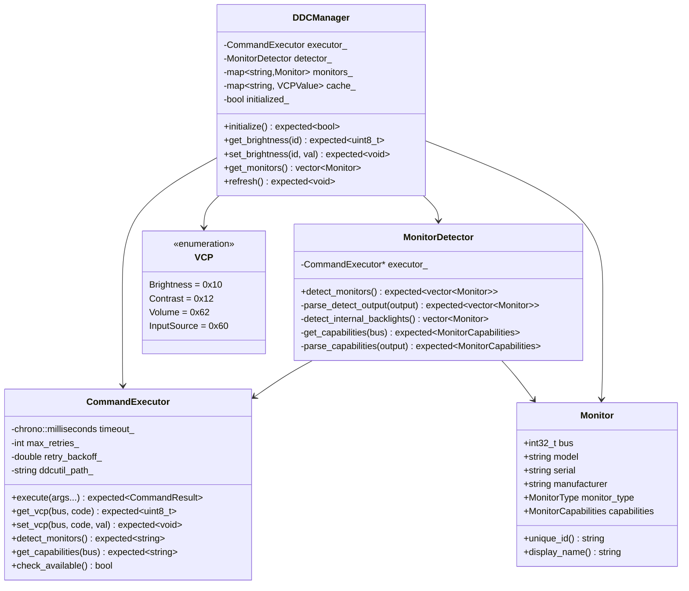
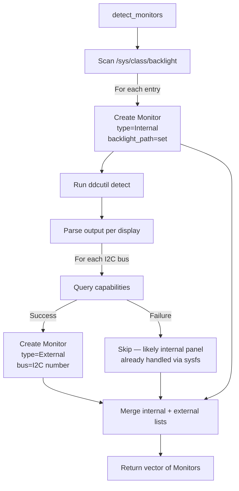
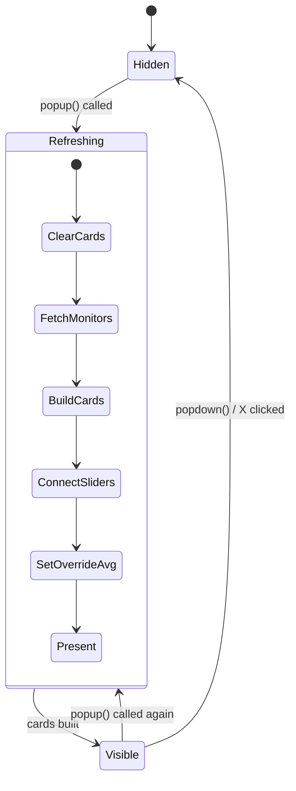
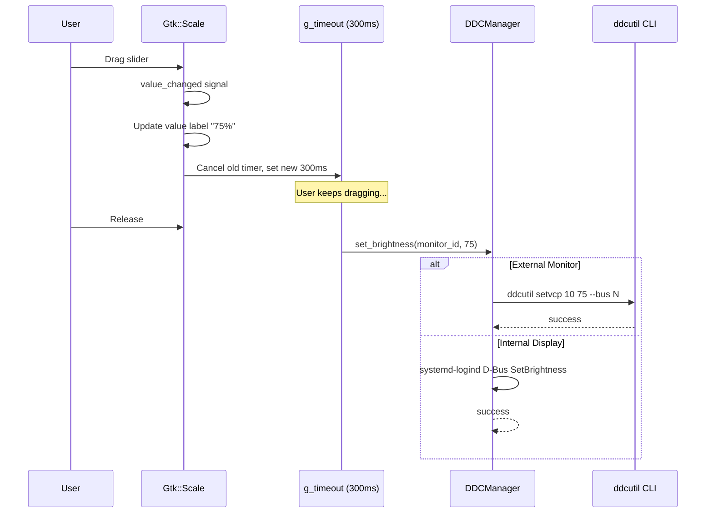
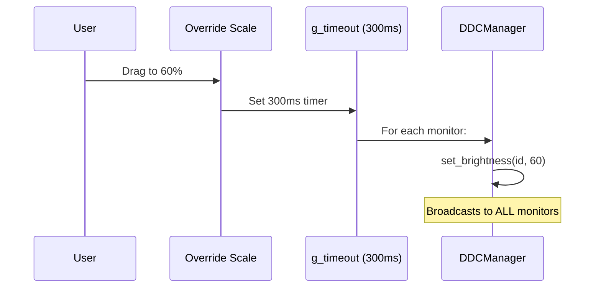
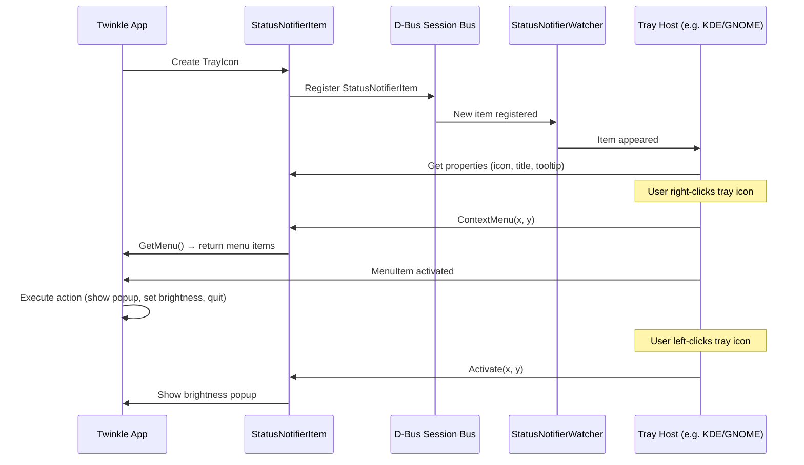

# Twinkle Linux — C++26 Architecture & Design

> Monitor brightness control for Linux. GTK4 system tray app with DDC/CI and
> backlight support. Ported from the proven Rust implementation.

---

## Table of Contents

1. [Architecture Overview](#architecture-overview)
2. [C++26 Features & Rationale](#cpp26-features--rationale)
3. [Module Design](#module-design)
4. [UI Component Tree](#ui-component-tree)
5. [Data Flow](#data-flow)
6. [System Tray (SNI over D-Bus)](#system-tray-sni-over-d-bus)
7. [Error Handling Strategy](#error-handling-strategy)
8. [Build & Dependencies](#build--dependencies)

---

## Architecture Overview

```mermaid
graph TB
    subgraph "UI Layer (GTK4)"
        APP[Gtk::Application]
        WIN[ApplicationWindow]
        POPUP[BrightnessPopup]
        TRAY[TrayIcon<br/>SNI via sdbus-c++]
        SETTINGS[SettingsDialog]
    end

    subgraph "Core Layer"
        CFG[ConfigManager<br/>JSON via nlohmann/json]
        LOG[Logger<br/>fmt-based]
    end

    subgraph "DDC Layer"
        DDC[DDCManager<br/>High-level API]
        DET[MonitorDetector]
        CMD[CommandExecutor<br/>ddcutil subprocess]
        VCP[VCP Codes<br/>constexpr registry]
    end

    subgraph "System"
        DDCUTIL[ddcutil CLI]
        DBUS_SYSTEM[systemd-logind D-Bus]
        SYSFS[/sys/class/backlight]
    end

    APP --> WIN
    WIN --> POPUP
    APP --> TRAY
    POPUP --> DDC
    POPUP --> CFG
    TRAY --> POPUP
    TRAY --> SETTINGS
    SETTINGS --> CFG

    DDC --> DET
    DDC --> CMD
    DDC --> VCP
    DET --> CMD
    CMD --> DDCUTIL
    DDC --> DBUS_SYSTEM
    DET --> SYSFS

    CFG --> LOG
    DDC --> LOG
```

### Component Responsibilities

| Component | Responsibility |
|-----------|---------------|
| `Gtk::Application` | Main loop, app lifecycle, unique instance |
| `BrightnessPopup` | Per-monitor card UI with sliders, debounce |
| `TrayIcon` | StatusNotifierItem over D-Bus, presets menu |
| `SettingsDialog` | 4-tab notebook: General, UI, Behavior, Advanced |
| `DDCManager` | High-level brightness API, caching, detection |
| `CommandExecutor` | Subprocess spawn with retry/backoff |
| `MonitorDetector` | Parse `ddcutil detect`, scan `/sys/class/backlight` |
| `ConfigManager` | Load/save JSON config, XDG paths |

---

## C++26 Features & Rationale

### Why C++26?

The implementation targets C++26 (GCC 15+ / Clang 19+) to leverage several
features that eliminate boilerplate and improve safety over C++23:

### 1. `std::expected<T, E>` — Zero-overhead Error Handling

Replaces the hand-rolled `Result<T>` type from C++23. Provides monadic
operations (`.and_then()`, `.or_else()`, `.transform()`) for clean chaining.

```cpp
// Instead of:
auto result = executor.get_vcp(bus, VCP::Brightness);
if (!result.has_value()) { return Result<void>(result.error()); }
auto value = result.value();

// C++26:
return executor.get_vcp(bus, VCP::Brightness)
    .and_then([&](uint8_t val) -> std::expected<void, DDCError> {
        // ...
    });
```

### 2. Reflection (`<meta>`) — Eliminates Boilerplate

The biggest win for this codebase. C++26 static reflection via `meta::info`
enables:

**a) Automatic VCP Code Registry**

We define 50+ VCP codes as an `enum class`. Reflection auto-generates:
- `to_string()` / `from_string()`
- Value range validation
- Feature name lookup

```cpp
enum class VCP : uint8_t {
    Brightness = 0x10,
    Contrast   = 0x12,
    Volume     = 0x62,
    // ... 50 more codes
};

// Reflection generates this at compile time:
consteval auto vcp_name(VCP code) -> std::string_view {
    template for (constexpr auto member : meta::members_of(^VCP)) {
        if (valueof(member) == static_cast<uint8_t>(code))
            return name_of(member);
    }
    return "Unknown";
}
```

**b) Config Struct Serialization**

No hand-written JSON serialization. Reflection walks struct members:

```cpp
struct AppConfig {
    GeneralConfig general;
    UIConfig ui;
    BehaviorConfig behavior;
    // ...
};

// Auto-generated to_json / from_json via reflection
template for (constexpr auto member : meta::members_of(^AppConfig)) {
    json[name_of(member)] = value.(member);
}
```

**c) CSS Class Generation**

GTK4 CSS class names derived from struct field names at compile time —
no string typos possible.

### 3. `std::print` / `std::format` — Type-safe Output

Replaces `fmt::format` for standard compliance while keeping the same API.
Fallback to `fmt` where `std::print` isn't available yet.

### 4. `constexpr` Everything

VCP code tables, config defaults, and UI constants are all `constexpr`.
Zero runtime initialization cost.

### 5. `std::latch` / `std::barrier` — Async Coordination

Used for coordinating monitor detection across multiple ddcutil subprocess
calls.

---

## Module Design

### DDC Module



### Monitor Type Discrimination



### Backlight Control Paths

```mermaid
flowchart LR
    subgraph "External Monitors"
        SET_EXT[set_brightness] --> DDCUTIL[ddcutil setvcp]
        DDCUTIL --> I2C[/dev/i2c-N]
    end

    subgraph "Internal Display"
        SET_INT[set_brightness] --> DBUS[systemd-logind D-Bus]
        DBUS --> |SetBrightness| SYSFS[/sys/class/backlight/...]
    end
```

---

## UI Component Tree

```mermaid
graph TD
    APP[Gtk::Application] --> AWIN[ApplicationWindow<br/>hidden, 1x1 undecorated]

    AWIN --> |parent for| POPUP[Gtk::Window "Brightness"<br/>transient_for AWIN]

    POPUP --> MAINBOX[Gtk::Box vertical .main-container]
    MAINBOX --> HEADER[Gtk::Label "Brightness" .header-label]
    MAINBOX --> CARDS[Gtk::Box vertical .cards-container]
    MAINBOX --> OVERRIDE[Gtk::Box vertical .all-monitors-row]
    MAINBOX --> SEP[Gtk::Box .separator]
    MAINBOX --> BOTTOM[Gtk::Box horizontal .bottom-toolbar]

    OVERRIDE --> OH[Header: sun icon + "All Monitors" + value label]
    OVERRIDE --> OS[Slider row: dim icon + Scale + bright icon]

    CARDS --> |per monitor| CARD[Gtk::Box vertical .monitor-card]
    CARD --> CH[Header: monitor icon + name + value label]
    CARD --> CS[Slider row: dim icon + Scale + bright icon]

    BOTTOM --> SETTINGS_BTN[Gtk::Button "⚙" .icon-button]

    style OVERRIDE fill:#2a2a4a,color:#fff
    style CARD fill:#16213e,color:#fff
    style MAINBOX fill:#1a1a2e,color:#fff
```

### Popup Lifecycle



---

## Data Flow

### Slider → Monitor



### All-Monitors Override



---

## System Tray (SNI over D-Bus)

Uses the [StatusNotifierItem](https://freedesktop.org/wiki/Specifications/StatusNotifierItem/)
protocol via `sdbus-c++` — the same approach as `ksni` in the Rust version.
`GtkStatusIcon` is deprecated and does not work on modern desktops.



### Tray Menu Structure

```
┌─ Brightness Control        display-brightness-symbolic
│
├──  10%  (Night)            weather-clear-night-symbolic
├──  20%  (Dusk)             weather-overcast-symbolic
├──  40%  (Cloudy)           weather-few-clouds-symbolic
├──  60%  (Sunny)            weather-clear-symbolic
├──  80%  (Full Sun)         weather-clear-symbolic
├──  100%  (Max)             display-brightness-max-symbolic
│
├─ Settings                  preferences-system-symbolic
├─ About                     help-about-symbolic
├────────────────────────
└─ Quit                      application-exit-symbolic
```

---

## Error Handling Strategy

All fallible operations return `std::expected<T, DDCError>`:

```mermaid
flowchart TD
    CALL[Function call] --> RESULT{expected?}
    RESULT --> |has_value()| OK[Use *result or result->]
    RESULT --> |!has_value()| ERR[Check .error()]

    ERR --> LOG[LOG_WARN with error]
    LOG --> RECOVER[Recover gracefully]
    RECOVER --> |Slider| DEFAULT[Show default value 50%]
    RECOVER --> |Detect| EMPTY[Return empty monitor list]
    RECOVER --> |Config| DEFAULTS[Use default config]
```

No exceptions except for truly fatal errors (OOM, no display).
All GTK signal handlers are noexcept.

---

## Build & Dependencies

### Requirements

| Dependency | Version | Purpose |
|-----------|---------|---------|
| GCC | 15+ | C++26 compiler (reflection, expected) |
| CMake | 3.25+ | Build system |
| GTK4 | 4.6+ | UI toolkit |
| fmt | 10+ | Formatting (fallback for std::print) |
| nlohmann/json | 3.11+ | JSON config serialization |
| sdbus-c++ | 1.3+ | D-Bus SNI tray + systemd-logind |
| GTest | 1.13+ | Unit tests |

### Build Commands

```bash
mkdir build && cd build
cmake .. -DCMAKE_BUILD_TYPE=Release
cmake --build . -j$(nproc)
ctest --output-on-failure
```

### Directory Layout

```
twinkle-cpp/
├── CMakeLists.txt
├── DESIGN.md              ← this file
├── README.md
├── data/
│   └── style.css           ← GTK4 dark theme
├── include/twinkle/
│   ├── ddc/
│   │   ├── error.hpp       ← std::expected-based errors
│   │   ├── vcp_codes.hpp   ← constexpr VCP registry + reflection
│   │   ├── command.hpp      ← ddcutil subprocess wrapper
│   │   ├── monitor.hpp      ← Monitor struct + detector
│   │   └── ddc_manager.hpp  ← High-level DDC API
│   ├── core/
│   │   ├── config.hpp       ← JSON config with reflection serialization
│   │   └── logger.hpp       ← fmt-based logger
│   └── ui/
│       ├── brightness_popup.hpp  ← GTK4 popup with card sliders
│       ├── tray_icon.hpp         ← SNI D-Bus tray
│       └── widgets/
│           ├── brightness_slider.hpp  ← Debounced slider
│           └── settings_dialog.hpp    ← 4-tab settings
├── src/                     ← mirrors include/ structure
├── tests/
│   ├── CMakeLists.txt
│   └── test_*.cpp
└── scripts/
    └── install.sh
```
